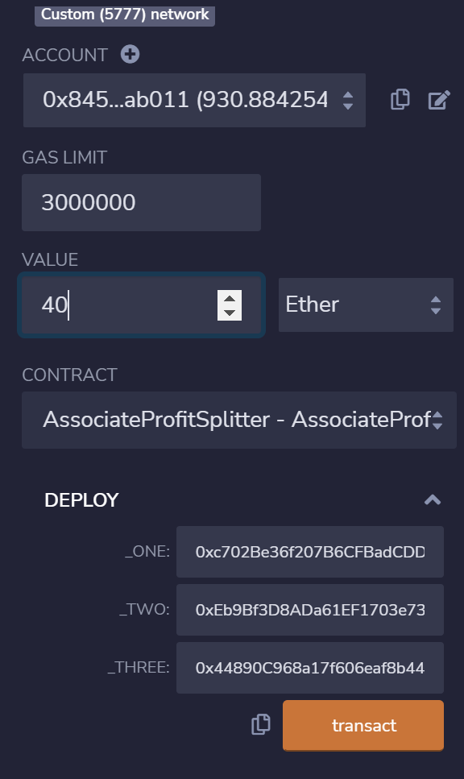
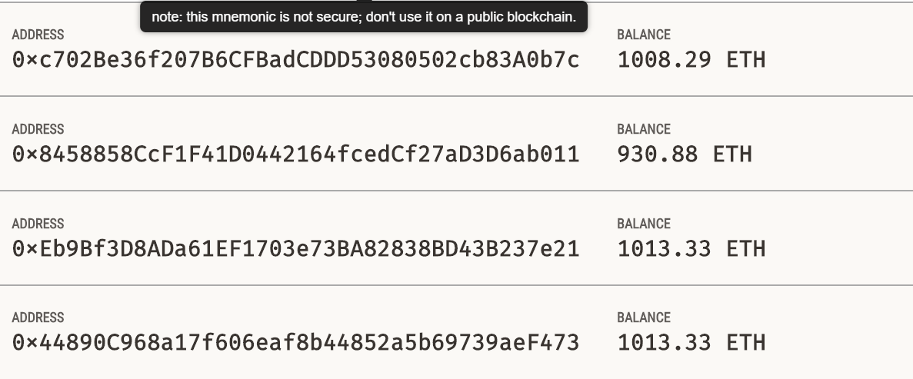
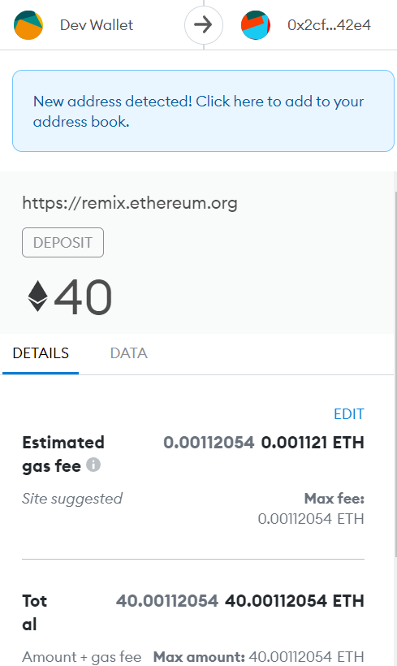
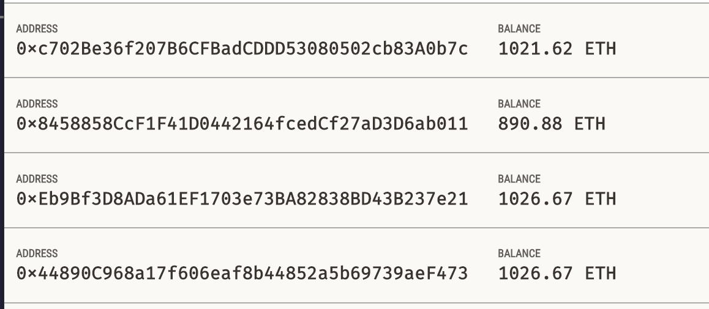

## Profit Splitter Contract

This contract will accept Ether into the contract and divide the Ether evenly among the associate level employees. This will allow the Human Resources department to pay employees quickly and efficiently.

To run this contract, you must have [Ganache](https://www.trufflesuite.com/ganache) installed on your local machine.

1) Open Ganache and load up a blockchain instance
2) Navigate to the [Remix IDE](https://remix.ethereum.org) and create a new contract with the code from `ProfitSplitter.sol`
3) Point your MetaMask wallet to `localhost:8545` or replace the port with what your have set in your Ganache workspace.
4) Deploy the contract with the addresses of the employees. 
5) Check the balances of the employee addresses on your before the deposit to the contract. 
6) Deposit the desired amount to employee addresses. 
7) Check to make sure the employees have recieved their funds. 

